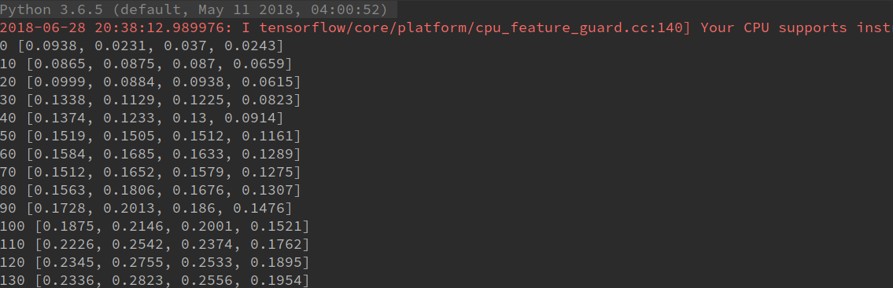
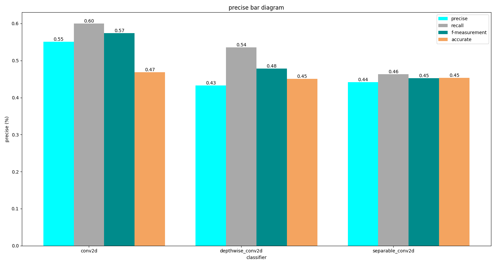

# report

### 运行结果

### 性能比较

### 讨论分析

#### 预处理

同样的，使用 hw3 处理好的数据，填补缺失值，更改异常值，不做过多介绍

#### 模型结构

特征数据进行归一化，label one hot 编码，卷积 + 激活，卷积2 + 激活2、BN归一化层 + 激活层，全连接层，输出层，使用 MBGD 算法

#### 评估

数量最多前十个栅格 Recall, Precise, F_measurement, 整体的预测正确率

#### 分析

- 迭代次数为 **1000** 通常，随着迭代次数的增加，效果会逐渐变好。

- 栅格选择问题，由于cnn 不适合类别较多的数据，因此选了大步长的栅格，在实验中选择了三个步长，结果对比如下

  | 步长 | precise | recall | f-measurement | accuracy |
  | :--: | :-----: | :----: | :-----------: | :------: |
  | 100  | 0.5210  | 0.5702 |    0.5445     |  0.4431  |
  | 150  | 0.5451  | 0.6373 |    0.5876     |  0.5146  |
  | 200  | 0.4047  | 0.5071 |    0.4501     |  0.4209  |

  大概 150 的时候，效果比较好，经过 onehot 编码后的类别只有40，这也意味着，即使预测正确了，误差也很大。

- 在卷积层于全连接层中间，我添加了 BN 归一化层，效果明显提升

- 通过三种卷积函数的比较，分别是`conv2d`， `depthwise_conv2d`，`separable_conv2d`三种的对比得出，最简单的`conv2d`效果最佳，运行效率也相对较快

- 由于数据维度较低，没有使用池化层进行降维，卷积核参数，strides 设置为`[1, 1, 1, 1]` padding 类型也选择`SAME`

