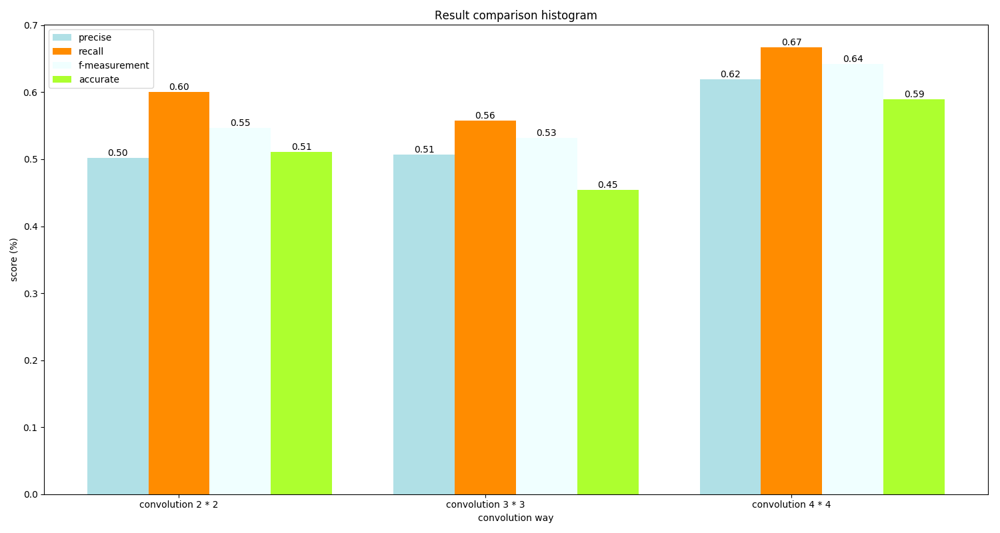
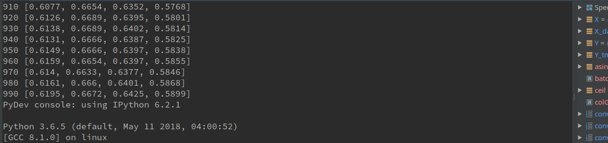
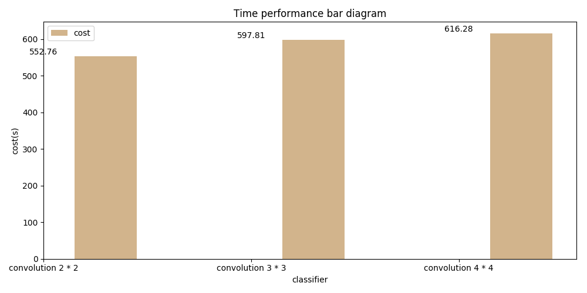

# report

### 运行结果

### 性能比较

### 运行时间比较

### 讨论分析

#### 预处理
同样的，使用 hw3 处理好的数据，填补缺失值，更改异常值，不做过多介绍

#### 模型结构
特征数据进行归一化，label one hot 编码，卷积 + 激活，卷积2 + 激活2、BN归一化层 + 激活层，全连接层，输出层，使用 MBGD 算法

#### 评估
数量最多前十个栅格 Recall, Precise, F_measurement, 整体的预测正确率

#### 分析

- 在第一题中我们已经得到比较适合卷积核类型为`conv2d`，在此题中只使用这个作为比较的对象，选择`2*2` 、`3*3`、`4*4`的卷积核大小进行比较，实验发现，`4*4`的卷积核效果最佳
- 从运行时间来看，随着卷积核的增大，迭代相同的次数运行时间会越长，因为计算量增大了许多。
- 通常，随着迭代次数的增加，效果会逐渐变好。